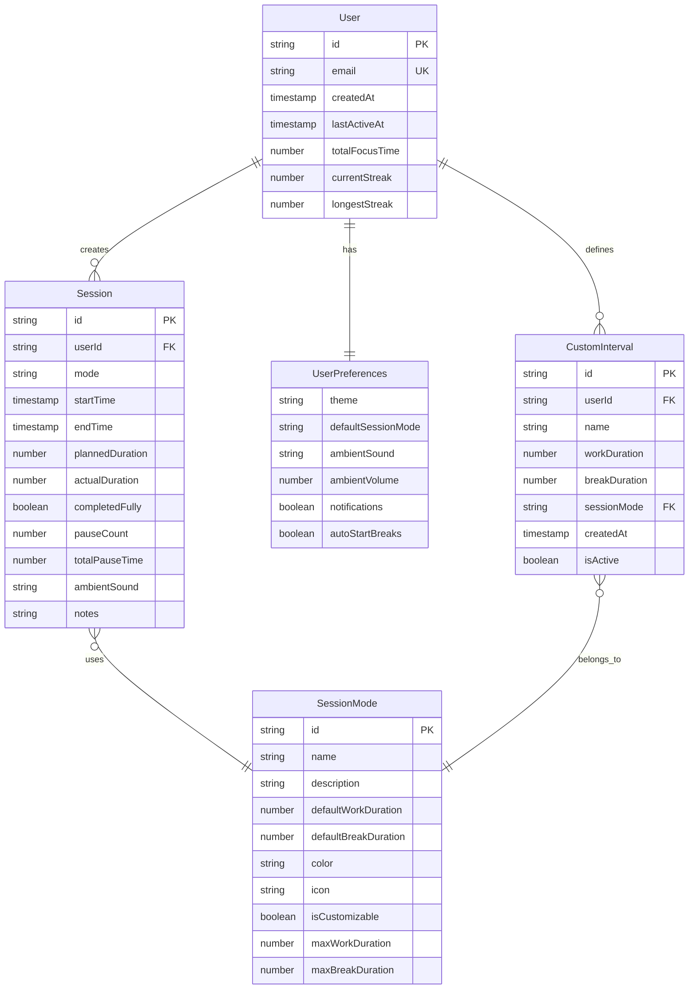

# Data Model: ZenFocus

**Date**: 2025-09-23
**Phase**: 1 - Design & Contracts
**Purpose**: Define data entities, relationships, and validation rules

## Core Entities

### User

Represents registered users who can save sessions and preferences across devices.

**Fields**:

- `id`: string (UUID) - Primary identifier
- `email`: string - User email address (unique)
- `createdAt`: timestamp - Account creation date
- `lastActiveAt`: timestamp - Last session activity
- `totalFocusTime`: number - Cumulative minutes of completed focus sessions
- `currentStreak`: number - Consecutive days with at least one completed session
- `longestStreak`: number - Historical longest streak
- `preferences`: UserPreferences - Embedded user settings

**Validation Rules**:

- Email must be valid format and unique
- Total focus time cannot be negative
- Streak values cannot be negative
- Last active timestamp cannot be in the future

**State Transitions**:

- Created → Active (on first login)
- Active → Inactive (no activity for 90 days)
- Active → Deleted (user-initiated deletion)

### UserPreferences

User-specific settings and customizations.

**Fields**:

- `theme`: enum ('light', 'dark', 'system') - UI theme preference
- `defaultSessionMode`: enum ('study', 'deepwork', 'yoga', 'zen') - Preferred session type
- `ambientSound`: string - Selected ambient sound ID ('rain', 'forest', 'ocean', 'silence')
- `ambientVolume`: number (0-100) - Volume level for ambient sounds
- `notifications`: boolean - Whether to show timer completion notifications
- `autoStartBreaks`: boolean - Whether breaks start automatically after work sessions
- `customIntervals`: CustomInterval[] - User-defined session intervals

**Validation Rules**:

- Theme must be one of allowed values
- Session mode must be valid
- Ambient volume must be 0-100
- Custom intervals must have positive durations

### Session

Represents a completed focus/work session with timing and mode information.

**Fields**:

- `id`: string (UUID) - Primary identifier
- `userId`: string (UUID, optional) - Associated user (null for guest sessions)
- `mode`: SessionMode - Session type and configuration
- `startTime`: timestamp - When session was started
- `endTime`: timestamp - When session was completed
- `plannedDuration`: number - Intended duration in minutes
- `actualDuration`: number - Actual completed duration in minutes
- `completedFully`: boolean - Whether session ran to completion
- `pauseCount`: number - Number of times session was paused
- `totalPauseTime`: number - Total time spent paused (in minutes)
- `ambientSound`: string - Ambient sound used during session
- `notes`: string (optional) - User notes about the session

**Validation Rules**:

- Start time must be before end time
- Actual duration must be positive
- Planned duration must be positive
- Pause count cannot be negative
- Total pause time cannot exceed actual duration
- End time cannot be in the future

**Relationships**:

- Belongs to User (optional, for guest sessions)
- References SessionMode for configuration

### SessionMode

Defines the different types of focus sessions with their characteristics.

**Fields**:

- `id`: string - Mode identifier ('study', 'deepwork', 'yoga', 'zen')
- `name`: string - Display name
- `description`: string - Mode description
- `defaultWorkDuration`: number - Default work period in minutes
- `defaultBreakDuration`: number - Default break period in minutes
- `color`: string - Theme color for UI
- `icon`: string - Icon identifier
- `isCustomizable`: boolean - Whether user can modify intervals
- `maxWorkDuration`: number (optional) - Maximum work period allowed
- `maxBreakDuration`: number (optional) - Maximum break period allowed

**Validation Rules**:

- Work duration must be positive
- Break duration must be positive (except for zen mode)
- Max durations must be greater than defaults if specified
- Color must be valid hex or CSS color
- Mode ID must be unique and lowercase

**Default Configurations**:

```typescript
const DEFAULT_MODES: SessionMode[] = [
  {
    id: 'study',
    name: 'Study Mode',
    description: 'Traditional Pomodoro technique for focused learning',
    defaultWorkDuration: 25,
    defaultBreakDuration: 5,
    color: '#10B981', // emerald-500
    icon: 'book',
    isCustomizable: true,
    maxWorkDuration: 90,
    maxBreakDuration: 30,
  },
  {
    id: 'deepwork',
    name: 'Deep Work',
    description: 'Extended focus periods for complex tasks',
    defaultWorkDuration: 50,
    defaultBreakDuration: 10,
    color: '#3B82F6', // blue-500
    icon: 'brain',
    isCustomizable: true,
    maxWorkDuration: 120,
    maxBreakDuration: 30,
  },
  {
    id: 'yoga',
    name: 'Yoga & Meditation',
    description: 'Customizable intervals for breathing and poses',
    defaultWorkDuration: 10,
    defaultBreakDuration: 2,
    color: '#8B5CF6', // violet-500
    icon: 'flower',
    isCustomizable: true,
    maxWorkDuration: 60,
    maxBreakDuration: 15,
  },
  {
    id: 'zen',
    name: 'Zen Mode',
    description: 'Open-ended timer for flexible focus',
    defaultWorkDuration: 0, // open-ended
    defaultBreakDuration: 0,
    color: '#6B7280', // gray-500
    icon: 'infinity',
    isCustomizable: false,
  },
]
```

### CustomInterval

User-defined session intervals for personalized timing.

**Fields**:

- `id`: string (UUID) - Primary identifier
- `userId`: string (UUID) - Associated user
- `name`: string - User-defined name for the interval
- `workDuration`: number - Work period in minutes
- `breakDuration`: number - Break period in minutes
- `sessionMode`: string - Associated session mode ID
- `createdAt`: timestamp - When custom interval was created
- `isActive`: boolean - Whether interval is currently in use

**Validation Rules**:

- Work duration must be positive
- Break duration must be non-negative
- Name must be non-empty and max 50 characters
- Session mode must reference valid mode
- User must own the custom interval

### TimerState (Client-side only)

Represents the current state of an active timer session.

**Fields**:

- `isActive`: boolean - Whether timer is currently running
- `isPaused`: boolean - Whether timer is paused
- `mode`: SessionMode - Current session mode
- `phase`: enum ('work', 'break') - Current timer phase
- `timeRemaining`: number - Seconds remaining in current phase
- `totalElapsed`: number - Total seconds elapsed in session
- `pauseStartTime`: timestamp (optional) - When current pause started
- `sessionStartTime`: timestamp - When session was initiated
- `currentCycle`: number - Current work/break cycle number
- `totalPauseTime`: number - Cumulative pause time in seconds

**State Transitions**:

- Idle → Active (user starts timer)
- Active → Paused (user pauses timer)
- Paused → Active (user resumes timer)
- Active → Idle (session completes or user resets)
- Work → Break (work period completes)
- Break → Work (break period completes, new cycle)

## Data Relationships



## Storage Implementation

### AWS Amplify DataStore (Authenticated Users)

- **User**: Full CRUD, sync across devices
- **Session**: Create/Read, batch sync for performance
- **CustomInterval**: Full CRUD, immediate sync
- **UserPreferences**: Full CRUD, immediate sync

### Local Storage (Guest Users)

- **Session**: Store last 30 days, JSON serialization
- **Preferences**: Store current session, fallback to defaults
- **TimerState**: Session storage for page refresh persistence

### Session Storage (Active Sessions)

- **TimerState**: Persist active timer through page refresh
- **CurrentSession**: Temporary session data before completion

## Data Migration Strategy

### Version 1.0 → 1.1 (Future)

- Add new fields with default values
- Maintain backward compatibility for 6 months
- Provide migration scripts for data transformation

### Schema Versioning

- Include schema version in data models
- Graceful degradation for newer schema on older clients
- Version-specific validation rules

---

**Phase 1 Status**: Data model complete
**Next**: API contracts and integration tests
