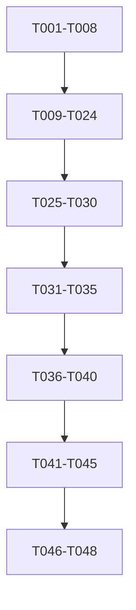

# Tasks: ZenFocus - Minimalistic Focus & Wellness Web App

**Input**: Design documents from `/specs/001-project-idea-zenfocus/`
**Prerequisites**: plan.md (required), research.md, data-model.md, contracts/

## Execution Flow (main)

```
1. Load plan.md from feature directory
   → Tech stack: Next.js 14+, TypeScript, Tailwind CSS, shadcn/ui, AWS Amplify
   → Structure: Web app (frontend + backend structure)
2. Load optional design documents:
   → data-model.md: 5 entities (User, UserPreferences, Session, SessionMode, CustomInterval, TimerState)
   → contracts/: API spec with 12 endpoints across 5 categories
   → quickstart.md: 5 integration test scenarios
3. Generate tasks by category:
   → Setup: Next.js project, dependencies, Amplify config
   → Tests: Contract tests for 12 endpoints, integration tests for 5 scenarios
   → Core: TypeScript models, services, components
   → Integration: API routes, auth, data persistence
   → Polish: E2E tests, performance optimization, accessibility
4. Apply task rules:
   → Contract tests [P], model creation [P], component creation [P]
   → API routes sequential (shared Next.js structure)
   → Tests before implementation (TDD)
5. Number tasks sequentially (T001-T048)
6. Dependencies: Setup → Tests → Models → Services → UI → Integration → Polish
7. SUCCESS: 48 tasks ready for execution
```

## Format: `[ID] [P?] Description`

- **[P]**: Can run in parallel (different files, no dependencies)
- File paths assume Next.js web app structure per plan.md

## Phase 3.1: Project Setup

- [x] T001 Create Next.js 14+ project with TypeScript and App Router in repository root
- [x] T002 [P] Install and configure Tailwind CSS with Next.js integration
- [x] T003 [P] Install and configure shadcn/ui component library
- [x] T004 [P] Install and configure AWS Amplify CLI and dependencies
- [x] T005 [P] Configure ESLint, Prettier, and TypeScript strict mode
- [x] T006 [P] Set up Jest and React Testing Library for unit testing
- [x] T007 [P] Set up Playwright for end-to-end testing
- [x] T008 Configure Amplify project structure (auth, datastore, hosting)

## Phase 3.2: Tests First (TDD) ⚠️ MUST COMPLETE BEFORE 3.3

**CRITICAL: These tests MUST be written and MUST FAIL before ANY implementation**

### Contract Tests

- [x] T009 [P] Contract test POST /api/auth/login in tests/contract/auth-login.test.ts
- [x] T010 [P] Contract test POST /api/auth/register in tests/contract/auth-register.test.ts
- [x] T011 [P] Contract test GET /api/users/me in tests/contract/users-me.test.ts
- [x] T012 [P] Contract test GET/PUT /api/users/me/preferences in tests/contract/user-preferences.test.ts
- [x] T013 [P] Contract test GET /api/session-modes in tests/contract/session-modes.test.ts
- [x] T014 [P] Contract test GET/POST /api/sessions in tests/contract/sessions.test.ts
- [ ] T015 [P] Contract test PUT /api/sessions/{id} in tests/contract/session-update.test.ts
- [ ] T016 [P] Contract test GET /api/sessions/stats in tests/contract/session-stats.test.ts
- [ ] T017 [P] Contract test GET/POST /api/custom-intervals in tests/contract/custom-intervals.test.ts
- [ ] T018 [P] Contract test PUT/DELETE /api/custom-intervals/{id} in tests/contract/custom-interval-crud.test.ts
- [ ] T019 [P] Contract test GET/POST/DELETE /api/timer/state in tests/contract/timer-state.test.ts

### Integration Tests

- [ ] T020 [P] Integration test guest timer session flow in tests/integration/guest-timer.test.ts
- [ ] T021 [P] Integration test theme and ambient sound switching in tests/integration/customization.test.ts
- [ ] T022 [P] Integration test session mode comparison in tests/integration/session-modes.test.ts
- [ ] T023 [P] Integration test user registration and data persistence in tests/integration/auth-flow.test.ts
- [ ] T024 [P] Integration test error handling and edge cases in tests/integration/error-handling.test.ts

## Phase 3.3: Core Implementation (ONLY after tests are failing)

### TypeScript Models and Validation

- [ ] T025 [P] User data model with validation in lib/models/user.ts
- [ ] T026 [P] UserPreferences data model with validation in lib/models/user-preferences.ts
- [ ] T027 [P] Session data model with validation in lib/models/session.ts
- [ ] T028 [P] SessionMode data model with validation in lib/models/session-mode.ts
- [ ] T029 [P] CustomInterval data model with validation in lib/models/custom-interval.ts
- [ ] T030 [P] TimerState data model with validation in lib/models/timer-state.ts

### Core Services

- [ ] T031 [P] Timer engine service with precision handling in lib/services/timer-service.ts
- [ ] T032 [P] Audio manager service for ambient sounds in lib/services/audio-service.ts
- [ ] T033 [P] State persistence service (localStorage/Amplify) in lib/services/persistence-service.ts
- [ ] T034 [P] Session tracking service in lib/services/session-service.ts
- [ ] T035 [P] User preferences service in lib/services/preferences-service.ts

### React Components

- [ ] T036 [P] Timer display component with progress ring in components/timer/timer-display.tsx
- [ ] T037 [P] Timer controls component (start/pause/reset) in components/timer/timer-controls.tsx
- [ ] T038 [P] Session mode tabs component in components/timer/session-modes.tsx
- [ ] T039 [P] Settings dialog component with preferences in components/settings/settings-dialog.tsx
- [ ] T040 [P] Session history component in components/history/session-history.tsx

## Phase 3.4: API Integration and Authentication

- [ ] T041 Authentication API routes (login/register) in app/api/auth/[...nextauth]/route.ts
- [ ] T042 User management API routes in app/api/users/route.ts and app/api/users/me/route.ts
- [ ] T043 Sessions API routes in app/api/sessions/route.ts and app/api/sessions/[id]/route.ts
- [ ] T044 Custom intervals API routes in app/api/custom-intervals/route.ts
- [ ] T045 Timer state API routes in app/api/timer/state/route.ts

## Phase 3.5: Integration and Polish

- [ ] T046 Amplify Auth integration and user session management
- [ ] T047 [P] End-to-end testing with Playwright following quickstart scenarios
- [ ] T048 [P] Performance optimization and accessibility compliance (WCAG 2.1)

## Dependencies



**Critical Path**:

- Setup (T001-T008) blocks everything
- Tests (T009-T024) must fail before implementation starts
- Models (T025-T030) block Services (T031-T035)
- Services block Components (T036-T040)
- Components block API routes (T041-T045)
- API routes block final integration (T046-T048)

## Parallel Execution Examples

### Contract Tests Phase (after setup)

```bash
# Launch T009-T019 together (all contract tests):
Task: "Contract test POST /api/auth/login in tests/contract/auth-login.test.ts"
Task: "Contract test POST /api/auth/register in tests/contract/auth-register.test.ts"
Task: "Contract test GET /api/users/me in tests/contract/users-me.test.ts"
Task: "Contract test GET/PUT /api/users/me/preferences in tests/contract/user-preferences.test.ts"
Task: "Contract test GET /api/session-modes in tests/contract/session-modes.test.ts"
Task: "Contract test GET/POST /api/sessions in tests/contract/sessions.test.ts"
Task: "Contract test PUT /api/sessions/{id} in tests/contract/session-update.test.ts"
Task: "Contract test GET /api/sessions/stats in tests/contract/session-stats.test.ts"
Task: "Contract test GET/POST /api/custom-intervals in tests/contract/custom-intervals.test.ts"
Task: "Contract test PUT/DELETE /api/custom-intervals/{id} in tests/contract/custom-interval-crud.test.ts"
Task: "Contract test GET/POST/DELETE /api/timer/state in tests/contract/timer-state.test.ts"
```

### Integration Tests Phase

```bash
# Launch T020-T024 together (all integration tests):
Task: "Integration test guest timer session flow in tests/integration/guest-timer.test.ts"
Task: "Integration test theme and ambient sound switching in tests/integration/customization.test.ts"
Task: "Integration test session mode comparison in tests/integration/session-modes.test.ts"
Task: "Integration test user registration and data persistence in tests/integration/auth-flow.test.ts"
Task: "Integration test error handling and edge cases in tests/integration/error-handling.test.ts"
```

### Data Models Phase

```bash
# Launch T025-T030 together (all TypeScript models):
Task: "User data model with validation in lib/models/user.ts"
Task: "UserPreferences data model with validation in lib/models/user-preferences.ts"
Task: "Session data model with validation in lib/models/session.ts"
Task: "SessionMode data model with validation in lib/models/session-mode.ts"
Task: "CustomInterval data model with validation in lib/models/custom-interval.ts"
Task: "TimerState data model with validation in lib/models/timer-state.ts"
```

### Core Services Phase

```bash
# Launch T031-T035 together (all services):
Task: "Timer engine service with precision handling in lib/services/timer-service.ts"
Task: "Audio manager service for ambient sounds in lib/services/audio-service.ts"
Task: "State persistence service (localStorage/Amplify) in lib/services/persistence-service.ts"
Task: "Session tracking service in lib/services/session-service.ts"
Task: "User preferences service in lib/services/preferences-service.ts"
```

### React Components Phase

```bash
# Launch T036-T040 together (all components):
Task: "Timer display component with progress ring in components/timer/timer-display.tsx"
Task: "Timer controls component (start/pause/reset) in components/timer/timer-controls.tsx"
Task: "Session mode tabs component in components/timer/session-modes.tsx"
Task: "Settings dialog component with preferences in components/settings/settings-dialog.tsx"
Task: "Session history component in components/history/session-history.tsx"
```

## Task Details

### Project Structure (T001)

- Initialize Next.js 14+ with TypeScript and App Router
- Create standard Next.js directory structure
- Configure next.config.js for optimal performance
- Set up package.json with required scripts

### Test Configuration (T006-T007)

- Jest configuration for TypeScript and React components
- React Testing Library setup with custom render utilities
- Playwright configuration for cross-browser E2E testing
- Test utilities and mock setup for Amplify services

### Data Models (T025-T030)

Each model includes:

- TypeScript interfaces with strict typing
- Zod validation schemas for runtime validation
- Helper functions for data transformation
- Unit tests for validation logic

### Services (T031-T035)

Each service includes:

- Business logic implementation
- Error handling and validation
- Integration with Amplify or browser APIs
- Unit tests with mocked dependencies

### Components (T036-T040)

Each component includes:

- TypeScript React component with props interface
- shadcn/ui integration for consistent styling
- Accessibility features (ARIA labels, keyboard navigation)
- Component-level tests with React Testing Library

### API Routes (T041-T045)

Each API route includes:

- Next.js App Router API handler
- Request/response validation with Zod
- Error handling and status codes per OpenAPI spec
- Integration with Amplify DataStore or Auth

## Validation Checklist

_GATE: Checked before task execution begins_

- [x] All contracts have corresponding tests (T009-T019)
- [x] All entities have model tasks (T025-T030)
- [x] All tests come before implementation (Phase 3.2 before 3.3)
- [x] Parallel tasks truly independent (different files)
- [x] Each task specifies exact file path
- [x] No task modifies same file as another [P] task
- [x] Integration tests cover quickstart scenarios
- [x] Task ordering follows TDD principles

## Notes

- [P] tasks can run simultaneously (different files, no dependencies)
- Verify all tests fail before starting implementation (T025+)
- Commit after each completed task for incremental progress
- Follow Next.js 14+ App Router conventions for file organization
- Use shadcn/ui components for consistent design system
- Maintain TypeScript strict mode throughout development
- Ensure offline timer functionality works without network
